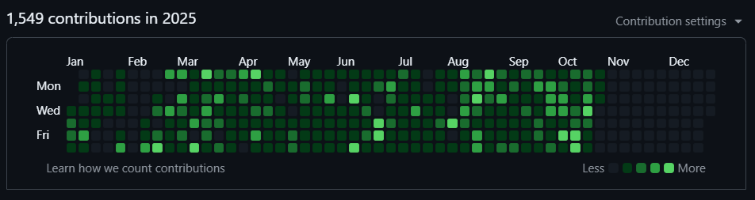

# OmGoyal27

Hi, I’m @OmGoyal27.

I’m interested in fun coding projects.

I’m currently learning python and want to learn cpp and sql next.
Fun fact: I wanted to learn coding/programming just because I wanted to open the world of infinite creations!

## About me

Name - Om Goyal

Hobbies - Just code and code (Yes I am serious)

Previous year commits:

This year's commits:

*The above given image will be updated every week*

I also have some other basic but fun projects that I don't upload to github, so add ~100 commits to the pool

> Total code commits: 365 + 1360 = 1725

Also, if somebody thinks these contributions are staged due to high number of contributions from March, that is because I had set on a mission, or you could say a streak, to code everyday. During exams, I only coded half an hour each day, so that my streak wouldn't break. But sometimes it broke, which made me really sad.

If you also think I only do 1-2 commits a day, that is false, because for some reason, GitHub thinks that only after 10 commits, will I be moved to the next stage of that colour. The stages of the colours that I am talking about are:

## Why learn coding?

I wanted to solve those little computer/tech problems that occur in our day to day life ranging from the tiniest copy and paste to automating functions.

And now I want it to be my full-time fun!
